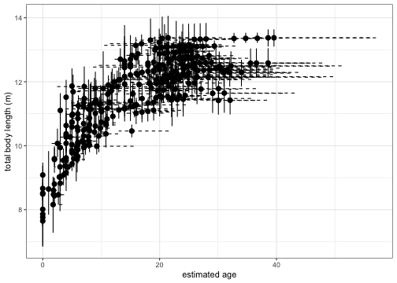
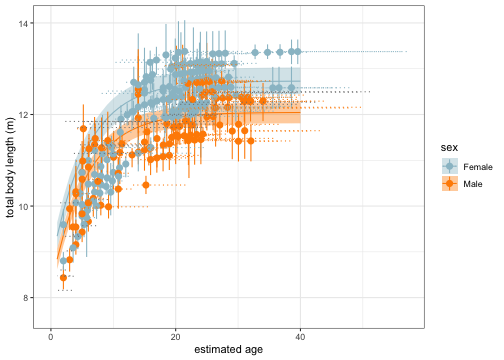

## Introduction

Before moving forward, be sure to first check out the [Xcertainty](Xcertainty.html) vignette on how to use the `independent_length_sampler()` for a proper introduction on how to use `Xcertainty`. This vignette focuses on the `growth_curve_sampler()`, which uses data containing individuals with replicate body length measurements and age information over time. This model fits a Von Bertalanffy-Putter growth curve to observations and incorporates measurement uncertainty associated with multiple drones following [Pirotta and Bierlich et al., 2024](https://doi.org/10.1111/gcb.17366). 


Von Bertalanffy-Putter growth curve equations involve three parameters: growth rate (*k*), asymptotic length (*A*), and the (theoretical) age when size is equal to 0 (*t0*).   

In this vignette, we'll use the `growth_curve_sampler()` to reproduce results derived from the data and methods described by [Pirotta and Bierlich et al., 2024](https://doi.org/10.1111/gcb.17366).  

We'll first load the Xcertainty package, as well as other packages we will use throughout this example.

```
## ℹ Updating Xcertainty documentation
## ✖ Installed roxygen2 is older than the version used with this package
## ℹ You have "7.3.1" but you need "7.3.2"
## ℹ Loading Xcertainty
```


```r
library(Xcertainty)

library(tidyverse)
library(ggdist)
library(coda)
```


### Data
We will use calibration and observation (whale) length and age data from [Pirotta and Bierlich et al., 2024](https://doi.org/10.1111/gcb.17366). This data includes imagery collected by five different UAS. Whale age's are estimated using photo-identification history and are labeled as either a 'known age' (if seen as a calf) or a 'minimum age' (based on the date of the first sighting). 

&nbsp;

#### Calibration data
We'll use a calibration dataset consisting of measurements of a 1 m wooden board collected by five different UAS at various altitudes (13-62 m). 

```r
data('calibration')

# sample size for each UAS
table(calibration$uas)
```

```
## 
## I2F I2O P3P P4P P4S 
## 259 198  32 155  13
```


### parse_observations()
We'll use `parse_observations()` to prepare the calibration and whale data. 
Measurements are often recorded in a wide-format dataframe, so parse_observations() converts to long-format data.  

```r
# parse calibration study
calibration_data = parse_observations(
  x = calibration, 
  subject_col = 'CO.ID',
  meas_col = 'Lpix', 
  tlen_col = 'CO.L', 
  image_col = 'image', 
  barometer_col = 'Baro_Alt',
  laser_col = 'Laser_Alt', 
  flen_col = 'Focal_Length', 
  iwidth_col = 'Iw', 
  swidth_col = 'Sw',
  uas_col = 'uas'
)
```

* This creates a list of three dataframes:   
    + `calibration_data$pixel_counts`.   
    + `calibration_data$training_objects`.    
    + `calibration_data$image_info`.  


Next, we'll use `parse_observations()` to prepare the whale data. Note, that the `timepoint_col` is set to year since we are interested in the total body length of each individual summarized at the yearly scale. 

```r
data('whales')

# parse field study
whale_data = parse_observations(
  x = whales, 
  subject_col = 'whale_ID',
  meas_col = 'TL.pix', 
  image_col = 'Image', 
  barometer_col = 'AltitudeBarometer',
  laser_col = 'AltitudeLaser', 
  flen_col = 'FocalLength', 
  iwidth_col = 'ImageWidth', 
  swidth_col = 'SensorWidth', 
  uas_col = 'UAS',
  timepoint_col = 'year'
)
```


&nbsp;

Now the calibration and whale data are both ready. Time to set up the sampler. 

&nbsp;

## The sampler
Note that `combine_observations()` is used to combine the `parse_calibrations()` outputs, `calibration_data` and `whale_data`. We will use non-informative priors here. 

```r
sampler = growth_curve_sampler(
  data = combine_observations(calibration_data, whale_data),
  priors = list(
    image_altitude = c(min = 0.1, max = 130),
    altimeter_bias = rbind(
      data.frame(altimeter = 'Barometer', mean = 0, sd = 1e2),
      data.frame(altimeter = 'Laser', mean = 0, sd = 1e2)
    ),
    altimeter_variance = rbind(
      data.frame(altimeter = 'Barometer', shape = .01, rate = .01),
      data.frame(altimeter = 'Laser', shape = .01, rate = .01)
    ),
    altimeter_scaling = rbind(
      data.frame(altimeter = 'Barometer', mean = 0, sd = 1e1),
      data.frame(altimeter = 'Laser', mean = 0, sd = 1e1)
    ),
    pixel_variance = c(shape = .01, rate = .01),
    # priors from Agbayani et al. 
    zero_length_age = c(mean = -5.09, sd = 0.4),
    growth_rate = c(mean = .18, sd = .01),
    # additional priors
    group_asymptotic_size = rbind(
      Female = c(mean = 12, sd = .5),
      Male = c(mean = 12, sd = .5)
    ),
    group_asymptotic_size_trend = rbind(
      Female = c(mean = 0, sd = 1),
      Male = c(mean = 0, sd = 1)
    ),
    subject_group_distribution = c(Female = .5, Male = .5),
    asymptotic_size_sd = c(min = 0, max = 10),
    min_calf_length = 3.5,
    # To model break points between 1990 and 2015
    group_size_shift_start_year = c(min = 1990, max = 2015)
  ),
  subject_info = whale_info
)
```

```
## Joining with `by = join_by(altimeter)`
## Joining with `by = join_by(altimeter)`
## Joining with `by = join_by(altimeter)`
## Joining with `by = join_by(UAS, altimeter)`
## Defining model
## [Note] Detected use of non-constant indexes: subject_group[1], subject_group[2], subject_group[3], subject_group[4], subject_group[5], subject_group[6],
## subject_group[7], subject_group[8], subject_group[9], subject_group[10], subject_group[11], subject_group[12], subject_group[13], subject_group[14],
## subject_group[15], subject_group[16], subject_group[17], subject_group[18], subject_group[19], subject_group[20], subject_group[21], subject_group[22],
## subject_group[24], subject_group[25], subject_group[26], subject_group[27], subject_group[28], subject_group[29], subject_group[31], subject_group[32],
## subject_group[33], subject_group[34], subject_group[35], subject_group[36], subject_group[37], subject_group[38], subject_group[39], subject_group[40],
## subject_group[41], subject_group[42], subject_group[43], subject_group[44], subject_group[45], subject_group[46], subject_group[47], subject_group[48],
## subject_group[49], subject_group[50], ... For computational efficiency we recommend specifying these in 'constants'.
## Building model
## Setting data and initial values
## Running calculate on model [Note] Any error reports that follow may simply reflect missing values in model variables.
## Checking model sizes and dimensions
## Compiling [Note] This may take a minute. [Note] Use 'showCompilerOutput = TRUE' to see C++ compilation details.
```

```
## ===== Monitors =====
## thin = 1: altimeter_bias, altimeter_scaling, altimeter_variance, asymptotic_size_sd, group_asymptotic_size, group_asymptotic_size_trend, group_size_shift_start_year, growth_rate, image_altitude, pixel_variance, subject_age_offset, subject_group, zero_length_age
## ===== Samplers =====
## RW sampler (1452)
##   - image_altitude[]  (1302 elements)
##   - zero_length_age
##   - growth_rate
##   - subject_age_offset[]  (130 elements)
##   - asymptotic_size_sd
##   - group_size_shift_start_year
##   - subject_asymptotic_size[]  (8 elements)
##   - object_length[]  (8 elements)
## conjugate sampler (151)
##   - altimeter_bias[]  (8 elements)
##   - altimeter_scaling[]  (8 elements)
##   - altimeter_variance[]  (8 elements)
##   - pixel_variance
##   - group_asymptotic_size[]  (2 elements)
##   - group_asymptotic_size_trend[]  (2 elements)
##   - subject_asymptotic_size[]  (122 elements)
## categorical sampler (32)
##   - subject_group[]  (32 elements)
## thin = 1: altimeter_bias, altimeter_scaling, altimeter_variance, asymptotic_size_sd, group_asymptotic_size, group_asymptotic_size_trend, group_size_shift_start_year, growth_rate, image_altitude, non_calf_length_age, object_length, pixel_variance, subject_age_offset, subject_asymptotic_size, subject_birth_year, subject_group, zero_length_age
```

```
## Compiling
##   [Note] This may take a minute.
##   [Note] Use 'showCompilerOutput = TRUE' to see C++ compilation details.
```


$nbsp;


Now run the sampler! When exploring data outputs, 1e4 or 1e5 can be good place for exploration, as this won't take too much time to run. We recommend using 1e6 for the final analysis since 1e6 MCMC samples is often enough to get a reasonable posterior effective sample size. 

```r
output_growth = sampler(niter = 1e4)
```

```
## Sampling
```

```
## |-------------|-------------|-------------|-------------|
## |-------------------------------------------------------|
```

```
## Extracting altimeter output
```

```
## Extracting image output
```

```
## Extracting pixel error output
```

```
## Extracting object output
```

```
## Extracting growth curve model output
```

```
## Extracting summaries
```


## View Sampler Outputs 
Our saved `output_growth` contains all the posterior samples and summaries from the sampler. Note, that there are many objects stored in `output_growth`, so it is best to view specific selections rather than viewing all of the objects stored in `output_growth` at once, as this can take a very long time to load and cause R to freeze. 

&nbsp;

You can view the posterior summaries (mean, sd, etc.) of total body length (TL) for each individual (Subject) at each Timepoint (year). Note that the `lower` and `upper` represent the 95% highest posterior density intervals (HPDI) of the posterior distribution for TL.

```r
head(output_growth$summaries$objects)
```

```
##   Subject Measurement Timepoint parameter     mean        sd    lower    upper       ESS  PSS
## 1       6      TL.pix      2020    length 13.46612 0.1229604 13.20953 13.70696 12.984632 5001
## 2       6      TL.pix      2021    length 13.46671 0.1229490 13.20642 13.70382 12.981883 5001
## 3      84      TL.pix      2017    length 12.29429 0.2611588 11.82116 12.76542  4.100977 5001
## 4      84      TL.pix      2018    length 12.29633 0.2613655 11.82277 12.76716  4.091021 5001
## 5      84      TL.pix      2020    length 12.29940 0.2616896 11.82643 12.77086  4.080244 5001
## 6      87      TL.pix      2018    length 11.86318 0.2962057 11.24694 12.33210  5.230519 5001
```


&nbsp;

We can view the posterior summaries (mean, sd, and lower and upper 95% HPDI) of the posterior distribution.

```r
output_growth$summaries$altimeters
```

```
##    UAS altimeter parameter       mean         sd      lower      upper        ESS  PSS
## 1  I2F Barometer      bias -0.7657916 0.42329017 -1.5548130  0.0366860  136.93684 5001
## 2  I2F Barometer  variance  3.5494599 0.28178490  3.0262148  4.1083104  423.01736 5001
## 3  I2F Barometer   scaling  0.9858973 0.01005701  0.9677114  1.0054144  116.34449 5001
## 4  I2F     Laser      bias -0.2219479 0.87396877 -1.8762869  1.4532594  108.80657 5001
## 5  I2F     Laser  variance  5.0199766 0.64363170  3.8207695  6.2813462  134.35557 5001
## 6  I2F     Laser   scaling  0.9587486 0.02014123  0.9205360  0.9979327  101.68899 5001
## 7  I2O Barometer      bias  2.8099101 0.41705828  2.0660121  3.6801129   80.66925 5001
## 8  I2O Barometer  variance  2.8164330 0.23040459  2.3650334  3.2681158  244.04878 5001
## 9  I2O Barometer   scaling  0.9077929 0.01214954  0.8834502  0.9302366   57.57603 5001
## 10 I2O     Laser      bias  1.8258200 0.52940856  0.7713228  2.8554556  115.96889 5001
## 11 I2O     Laser  variance  2.4908160 0.29235744  1.9258622  3.0446303  173.42277 5001
## 12 I2O     Laser   scaling  0.9205164 0.01578635  0.8916669  0.9546474  101.00099 5001
## 13 P3P Barometer      bias  9.1356589 1.37467876  6.5521453 11.8844912   71.67811 5001
## 14 P3P Barometer  variance  6.2525358 0.97228082  4.3888618  8.0744491  351.02109 5001
## 15 P3P Barometer   scaling  0.7033574 0.05354301  0.5923213  0.8001202   69.38209 5001
## 16 P4P Barometer      bias 11.1573089 0.73608444  9.8830030 12.7273361   48.20939 5001
## 17 P4P Barometer  variance  3.8350990 0.29518056  3.2626934  4.4080264  971.44248 5001
## 18 P4P Barometer   scaling  0.6317132 0.02969604  0.5682184  0.6842163   48.34513 5001
## 19 P4P     Laser      bias  9.6090170 5.42354767 -0.4678810 20.1408459   57.40420 5001
## 20 P4P     Laser  variance 37.0115577 7.22949843 23.9370206 51.4092210 3286.13379 5001
## 21 P4P     Laser   scaling  0.7689800 0.21753218  0.3545531  1.1832203   56.06666 5001
## 22 P4S Barometer      bias 19.4632203 1.95577601 15.8607367 23.3741740   99.07682 5001
## 23 P4S Barometer  variance  9.8557192 1.76102283  6.8484457 13.4674244 3800.05856 5001
## 24 P4S Barometer   scaling  0.3129661 0.07861159  0.1599713  0.4616343   93.74616 5001
```

We can view the posterior summaries of the pixel variance

```r
output_growth$pixel_error$summary
```

```
##   error parameter     mean       sd    lower    upper      ESS  PSS
## 1 pixel  variance 12.29105 3.202259 6.652635 18.61714 23.98477 5001
```

&nbsp;

Let's view a preview of the posterior summaries of the growth curve parameters, including k, t0, A for males and females, and individual's birth year.

```r
output_growth$summaries$growth_curve[1:10,]
```

```
##                             parameter          mean          sd         lower         upper        ESS  PSS
## 1                     zero_length_age   -6.49103598 0.170597788   -6.85508692   -6.22350029   1.649540 5001
## 2                         growth_rate    0.19337211 0.005476867    0.18487255    0.20150978   1.254382 5001
## 3        Female group_asymptotic_size   12.89885200 0.206754090   12.51025734   13.27186801   8.267542 5001
## 4          Male group_asymptotic_size   12.02597451 0.119321843   11.80133864   12.26157746 151.320452 5001
## 5  Female group_asymptotic_size_trend   -0.16827129 0.075617616   -0.31904100   -0.05961210  29.847742 5001
## 6    Male group_asymptotic_size_trend   -0.02400296 0.027155490   -0.06928842    0.03783454  85.784208 5001
## 7                        6 birth_year 1982.90534735 2.826534267 1976.76509911 1984.99880549 134.649951 5001
## 8                       84 birth_year 1986.28453959 4.911944566 1977.30208672 1988.99989043  36.250824 5001
## 9                       87 birth_year 1989.11808410 5.462169860 1977.22068263 1991.99798049  36.169864 5001
## 10                      89 birth_year 1990.00437717 2.887303540 1984.42877355 1991.98857888 128.013575 5001
```

&nbsp;


Let's now create a data frame with the posterior summaries for each individual's length. We will first save the total length output summaries, then save the birth year outputs, then combine both of these dataframes by `Subject`, and then join with `whale_info` to sync sex and AgeType Finally, we'll calculate the estimated age from the sample year from the estimated birth year. 

```r
# total length summary outputs for each subject
sums_L <- output_growth$summaries$objects

# birth year summary outputs for each subject
birth_year <- output_growth$growth_curve$birth_year$summary %>% rename_with(~str_c("birth_year_", .), everything()) %>%
  separate(birth_year_parameter, c("Subject", "Parameter"), sep = " ") %>% dplyr::select(!"Parameter")

# combine total length and birth year summary outputs. Then join with whale info to get sex, AgeType. Finally, calculated new estimated age. 
sum <- sums_L %>% 
  left_join(birth_year, by = "Subject") %>% mutate(Year = as.integer(Timepoint)) %>%
  left_join(whale_info %>% mutate(Subject = as.factor(Subject)) %>% rename(sex = Group), by = c("Subject", "Year")) %>% 
  relocate(Year, .before = Timepoint) %>% 
  mutate(Age_est_mean = Year - birth_year_mean, 
         Age_est_lower = Year - birth_year_upper, 
         Age_est_upper = Year - birth_year_lower)
```

&nbsp;

## Plot Growth Curves
We can view these results and plot the uncertainty associated with total body length (solid vertical line) and estimated age (dashed horizontal line).

```r
ggplot() + theme_bw() + 
  geom_pointrange(data = sum, aes(x = Age_est_mean, y = mean, ymin = lower, ymax = upper)) +
  geom_errorbarh(data = sum, 
                 aes(xmin = Age_est_lower, xmax = Age_est_upper, y = mean), lty = 2) + 
  xlab("estimated age") + ylab("total body length (m)") 
```



&nbsp; 

Now we'll calculate the expected growth for male and females separately between ages 1-40. We'll first save the posterior samplers of the growth parameters and sex-based asymptotic lengths in a dataframe. We'll then calculate the expected length for male and females at each age using the Von Bertalanffy-Putter growth equation for each MCMC iteration. This will generate a distribution for the expected length at each age for male and females separately. We can then summarize these distributions to get the mean expected length and uncertainty as the 95% HPDI. 

```r
# create a dataframe of the output growth parameters
pred_growth <- rbind(data.frame(t0 = output_growth$growth_curve$zero_length_age$samples,
           k = output_growth$growth_curve$growth_rate$samples,
           sex = "Female",
           A = output_growth$growth_curve$group_asymptotic_size$samples[,1]),
           data.frame(
           t0 = output_growth$growth_curve$zero_length_age$samples,
           k = output_growth$growth_curve$growth_rate$samples,
           sex = "Male",
           A = output_growth$growth_curve$group_asymptotic_size$samples[,2]))

# write a loop to calculate the expected length for male and females between ages 1-40 for each MCMC iteration to create a distribution. Then calculate the mean and HPDIs from the distribution for each expected length.
age_list <- seq(from  = 1, to = 40, by = 1)
sex_list <- c("Male", "Female")

age_df <- data.frame()
full_df <- data.frame()

for (s in sex_list){
  s_x = s
for (i in age_list){
  yr0 = i
  growth_filt = pred_growth %>% filter(sex == s_x)
  Exp.L = growth_filt$A * (1-exp(-growth_filt$k * (yr0 - growth_filt$t0)))
  Exp.L_mean = mean(Exp.L)
  Exp.L_lower = HPDinterval(mcmc(Exp.L))[1]
  Exp.L_upper = HPDinterval(mcmc(Exp.L))[2]
  temp_df <- data.frame(age = yr0, sex = s_x, 
                        Exp.L_mean, Exp.L_lower = Exp.L_lower, Exp.L_upper = Exp.L_upper) 
  age_df <- rbind(age_df, temp_df)
}
  full_df <- rbind(full_df, age_df)
}
```


$nbsp; 


Now we can plot the results 

```r
ggplot() + theme_bw() + 
  xlab("estimated age") + ylab("total body length (m)") + 
  geom_ribbon(data = full_df, aes(x = age, ymin = Exp.L_lower, ymax = Exp.L_upper, fill = sex), alpha = 0.4) + 
  geom_line(data = full_df, aes(x = age, y = Exp.L_mean, color = sex)) +
  scale_color_manual(values = c(Female = "lightblue3", Male = "darkorange")) +
  scale_fill_manual(values = c(Female = "lightblue3", Male = "darkorange")) +
  geom_pointrange(data = sum %>% filter(!is.na(sex)),
                  aes(x = Age_est_mean, y = mean, ymin = lower, ymax = upper, color = sex)) +
  geom_errorbarh(data = sum, 
                 aes(xmin = Age_est_lower, xmax = Age_est_upper, y = mean, color = sex), lty = 3) 
```



&nbsp;

Note, you can create custom samplers to use different growth equations (i.e., Gompertz, etc.). See  [Xcertainty](https://github.com/MMI-CODEX/Xcertainty/tree/main) to learn more. 
