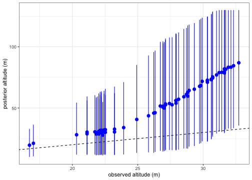
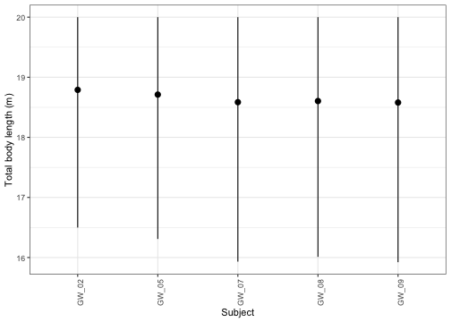
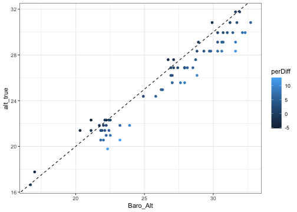
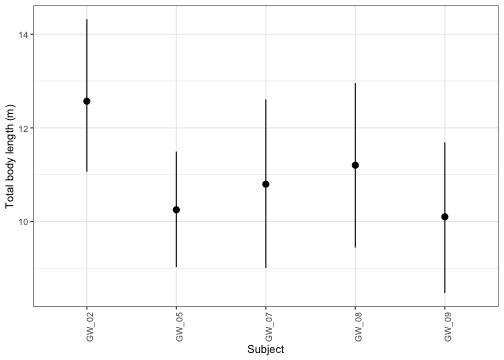

## Introduction
Before moving forward, be sure to first check out the [Xcertainty](Xcertainty.html) vignette on how to use the `independent_length_sampler()` with non-informative priors for a proper introduction on how to use `Xcertainty`. 

You should always first start with using non-informative priors. In some cases, assigning informative priors can be helpful, especially with low-cost off-the-shelf drones that are more susceptible to high errors and when the model is overparameterized. For this vignette, we'll focus on how to use informative priors using the `independent_length_sampler()`. We will first show an example using non-informative priors and how to identify faulty posterior outputs. We'll then show some steps for trouble shooting and when informative priors may be appropriate to use. We'll then build a sampler using informative priors and view the outputs. 

&nbsp;


## Example: Gray whale body length
We will use the same small example dataset consisting of body length and body width measurements of Pacific Coast Feeding Group (PCFG) gray whales from the [Xcertainty](Xcertainty.html) vignette. This time, we will use measurement data collected with a DJI Phantom 4 Pro (P4P, n = 5 individuals). The P4P contains only a barometer (no LiDAR altimeter) for estimating altitude, which are prone to greater errors and can often generate outliers. 

Note, that wide-angle lenses, such as the 8.8 mm focal length lens on the P4P, are susceptible to barrel distortion. Many manufacturers use internal processing to automatically correct for the effects of barrel distortion. We lab tested the field of view (FOV) for the P4P following Segre (in prep) and calculated an adjusted focal length that matches the corrections from the internal processing. We thus will use this adjusted focal length (`Focal_Length_adj`) in the sampler. 

We'll first run the P4P data using non-informative priors, view the faulty outputs, troubleshoot, and then run the sampler again using informative priors. 


&nbsp;

We'll first load the Xcertainty package, as well as other packages we will use throughout this example.

```r
library(Xcertainty)

library(tidyverse)
library(ggdist)
```


### Calibration Objects
First we'll load and prepare the calibration data, which is from [Bierlich et al., 2024](https://doi.org/10.1139/dsa-2023-0051). Note that "CO" here stands for "Calibration Object" used for training data, and "CO.L" is the true length of the CO (1 m) and "Lpix" is the photogrammetric measurement of the CO in pixels. Each UAS has a unique CO.ID so that the training data and observation (whale) data can be linked. We will filter to use CO data from the P4P drone.

```r
# load calibration measurement data
data("co_data")

# sample size for both drones
table(co_data$uas)
```

```
## 
##  I2 P4P 
##  49  69
```

```r
# filter for P4P drone
co_data_p4p <- co_data %>% filter(uas == "P4P")
```


Next, well format the data using `parse_observations()`.

```r
calibration_data = parse_observations(
  x = co_data_p4p, 
  subject_col = 'CO.ID',
  meas_col = 'Lpix', 
  tlen_col = 'CO.L', 
  image_col = 'image', 
  barometer_col = 'Baro_Alt',
  laser_col = 'Laser_Alt', 
  flen_col = 'Focal_Length_adj', 
  iwidth_col = 'Iw', 
  swidth_col = 'Sw',
  uas_col = 'uas'
)
```

This creates a list of four elements:   
    * `calibration_data$pixel_counts`.   
    * `calibration_data$training_objects`.    
    * `calibration_data$image_info`.
    * `calibration_data$prediction_objects` 
 

### Gray whale measurements
Now we'll load and prepare the gray whale measurement data. The column 'whale_ID' denotes the unique individual. Note, some individuals have multiple images --  Xcertainty incorporates measurements across images for an individual to produce a single posterior distribution for the measurement of that individual. For example, multiple body length measurements from different images of an individual will produce a single posterior distribution of body length for that individual. 

As in the [Xcertainty](Xcertainty.html) vignette, we will select body widths between 20-70% of body length for estimating body condition. We'll save the column names of these widths as their own object.  

For this example, we will only use whale measurements collected using the P4P drone.

```r
# load gray whale measurement data
data("gw_data")

# filter for I2 drone and select specific widths to include for estimating body condition (20-70%)
gw_measurements <- gw_data %>% filter(uas == "P4P") %>% 
  select(!c("TL_w05.00_px", "TL_w10.00_px", "TL_w15.00_px", 
            "TL_w75.00_px", "TL_w80.00_px", "TL_w85.00_px", "TL_w90.00_px", "TL_w95.00_px"))

# identify the width columns in the dataset
width_names = grep(
  pattern = 'TL_w\\_*', 
  x = colnames(gw_measurements),
  value = TRUE
)

# view the data, note that some individuals have multiple images.
gw_measurements
```

```
## # A tibble: 7 × 26
##   whale_ID image   year   DOY uas   Focal…¹ Focal…²    Sw    Iw Baro_…³ Launc…⁴ Baro_…⁵ Laser…⁶ CO.ID TL_px TL_w2…⁷ TL_w2…⁸ TL_w3…⁹
##   <chr>    <chr>  <int> <int> <chr>   <dbl>   <dbl> <dbl> <int>   <dbl>   <dbl>   <dbl>   <dbl> <chr> <dbl>   <dbl>   <dbl>   <dbl>
## 1 GW_02    image…  2019   249 P4P       8.8     9.2  13.2  3840    25.6    1.72    27.3      NA CO_P… 1185.    151.    169.    197.
## 2 GW_02    image…  2019   249 P4P       8.8     9.2  13.2  3840    25.6    1.72    27.3      NA CO_P… 1203.    151.    181.    202.
## 3 GW_05    image…  2019   203 P4P       8.8     9.2  13.2  3840    25.5    1.72    27.2      NA CO_P…  986.    115.    130.    148.
## 4 GW_05    image…  2019   203 P4P       8.8     9.2  13.2  3840    25.5    1.72    27.2      NA CO_P…  957.    125.    140.    158.
## 5 GW_07    image…  2019   280 P4P       8.8     9.2  13.2  3840    24.7    1.72    26.4      NA CO_P… 1023.    121.    137.    155.
## 6 GW_08    image…  2019   280 P4P       8.8     9.2  13.2  3840    25.5    1.72    27.2      NA CO_P… 1020.    123.    132.    144.
## 7 GW_09    image…  2019   180 P4P       8.8     9.2  13.2  3840    25.5    1.72    27.2      NA CO_P…  928.    104.    116.    131.
## # … with 8 more variables: TL_w35.00_px <dbl>, TL_w40.00_px <dbl>, TL_w45.00_px <dbl>, TL_w50.00_px <dbl>, TL_w55.00_px <dbl>,
## #   TL_w60.00_px <dbl>, TL_w65.00_px <dbl>, TL_w70.00_px <dbl>, and abbreviated variable names ¹​Focal_Length, ²​Focal_Length_adj,
## #   ³​Baro_raw, ⁴​Launch_Ht, ⁵​Baro_Alt, ⁶​Laser_Alt, ⁷​TL_w20.00_px, ⁸​TL_w25.00_px, ⁹​TL_w30.00_px
```


Next, we'll use `parse_observations()` to prepare the whale data. Since `Xcertainty` incorporates errors associated with both a LiDAR altimeter and a barometer into the output measurement, the input measurements must be in pixels. In our example dataset of gray whales, measurements are already in pixels. If measurements in a dataframe are in meters, they can easily be converted into pixels using `alt_conversion_col` to assign which altitude column should be used to "back calculate" measurements in meters into pixels. For example, use `alt_conversion_col = 'Baro_Alt` if the measurements used the barometer to convert measurements into meters. 

&nbsp;

Also, note that we assign the measurement column (`meas_col`) for TL and the widths between 20-70% that we saved as "width_names". 

```r
# parse field study
whale_data = parse_observations(
  x = gw_measurements, 
  subject_col = 'whale_ID',
  meas_col = c('TL_px', width_names),
  image_col = 'image', 
  barometer_col = 'Baro_Alt',
  laser_col = 'Laser_Alt', 
  flen_col = 'Focal_Length_adj', 
  iwidth_col = 'Iw', 
  swidth_col = 'Sw', 
  uas_col = 'uas'
  #alt_conversion_col = 'altitude'
)
```

  
This creates a list of four elements:   
    * `calibration_data$pixel_counts`.   
    * `calibration_data$training_objects`.    
    * `calibration_data$image_info`.
    * `calibration_data$prediction_objects`


## Build sampler (non-informative priors)
Now we will build a sampler using non-informative priors, the same as in the [Xcertainty](Xcertainty.html) vignette. This includes setting the altitudes (`image_altitude`) and object length measurements (`object_lengths`) to cover an overly wide range for our target species.  

```r
sampler = independent_length_sampler(
  data = combine_observations(calibration_data, whale_data),
  priors = list(
    image_altitude = c(min = 0.1, max = 130),
    altimeter_bias = rbind(
      data.frame(altimeter = 'Barometer', mean = 0, sd = 1e2),
      data.frame(altimeter = 'Laser', mean = 0, sd = 1e2)
    ),
    altimeter_variance = rbind(
      data.frame(altimeter = 'Barometer', shape = .01, rate = .01),
      data.frame(altimeter = 'Laser', shape = .01, rate = .01)
    ),
    altimeter_scaling = rbind(
      data.frame(altimeter = 'Barometer', mean = 1, sd = 1e1),
      data.frame(altimeter = 'Laser', mean = 1, sd = 1e1)
    ),
    pixel_variance = c(shape = .01, rate = .01),
    object_lengths = c(min = .01, max = 20)
  )
)
```

```
## Joining with `by = join_by(altimeter)`
## Joining with `by = join_by(altimeter)`
## Joining with `by = join_by(altimeter)`
## Joining with `by = join_by(UAS, altimeter)`
## Defining model
## Building model
## Setting data and initial values
## Running calculate on model [Note] Any error reports that follow may simply reflect missing values in model variables.
## Checking model sizes and dimensions
## Compiling [Note] This may take a minute. [Note] Use 'showCompilerOutput = TRUE' to see C++ compilation details.
```

```
## ===== Monitors =====
## thin = 1: altimeter_bias, altimeter_scaling, altimeter_variance, image_altitude, object_length, pixel_variance
## ===== Samplers =====
## RW sampler (136)
##   - image_altitude[]  (76 elements)
##   - object_length[]  (60 elements)
## conjugate sampler (4)
##   - altimeter_bias[]  (1 element)
##   - altimeter_scaling[]  (1 element)
##   - altimeter_variance[]  (1 element)
##   - pixel_variance
```

```
## Compiling
##   [Note] This may take a minute.
##   [Note] Use 'showCompilerOutput = TRUE' to see C++ compilation details.
```


## Run Sampler
Now we can run the sampler. Note, that "niter" refers to the number of iterations. When exploring data outputs, 1e4 or 1e5 can be good place for exploration, as this won't take too much time to run. We recommend using 1e6 for the final analysis since 1e6 MCMC samples is often enough to get a reasonable posterior effective sample size. In our example, we do not have that many individuals so we'll stick with 1e6.  

```r
# run sampler
output = sampler(niter = 1e6, thin = 10)
```

```
## Sampling
```

```
## |-------------|-------------|-------------|-------------|
## |-------------------------------------------------------|
```

```
## Extracting altimeter output
```

```
## Extracting image output
```

```
## Extracting pixel error output
```

```
## Extracting object output
```

```
## Extracting summaries
```


## View Sampler Outputs (TL and widths) 
Our saved `output` contains all the posterior samples and summaries of all training data and length and width measurements from the sampler. Note, that there are many objects stored in `output`, so it is best to view specific selections rather than viewing all of the objects stored in `output` at once, as this can take a very long time to load and cause R to freeze. 

&nbsp;

We can view the posterior summaries (mean, sd, etc.) for each altimeter. Note that the `lower` and `upper` represent the 95% highest posterior density intervals (HPDI) of the posterior distribution (similar to credible intervals).

```r
output$summaries$altimeters
```

```
##   UAS altimeter parameter        mean         sd      lower      upper      ESS   PSS
## 1 P4P Barometer      bias 22.24519388 1.06820010 20.1786000 24.3794205 22330.09 50001
## 2 P4P Barometer  variance 11.98614788 2.62266479  7.3401890 17.3008615 31093.82 50001
## 3 P4P Barometer   scaling  0.08441322 0.02036686  0.0438131  0.1242809 16056.95 50001
```

&nbsp;

Note that the bias and variance is very large. 

When we view and compare the posterior outputs for each image's altitude compared to the observed altitude from the barometer (dashed line represents 1:1), the altitudes are way off with extremely large uncertainty.

```r
output$summaries$images %>% left_join(co_data %>% rename(Image = image), by = "Image") %>%
  ggplot() + theme_bw() + 
  geom_pointrange(aes(x = Baro_Alt, y = mean, ymin = lower, ymax = upper), color = "blue") +
  geom_abline(slope = 1, intercept = 0, lty = 2) + 
  ylab("posterior altitude (m)") + xlab("observed altitude (m)")
```

```
## Warning: Removed 7 rows containing missing values (`geom_pointrange()`).
```



&nbsp;

We also see that the pixel variance from the training data is a bit outrageous.

```r
output$pixel_error$summary
```

```
##   error parameter     mean       sd    lower    upper      ESS   PSS
## 1 pixel  variance 1850.554 424.1212 1061.015 2709.165 16096.64 50001
```


&nbsp;

When we view the posterior summaries (mean, sd, and upper and lower 95% HPDI) for all measurements of each individual whale. We first notice that these measurements are unrealistically large. For example, most PCFG gray whales are between 8-13 m, and our TL output is >18 m! The body widths are also about 1 m larger than they should be.

```r
head(output$summaries$objects)
```

```
##   Subject  Measurement Timepoint parameter      mean        sd     lower     upper      ESS   PSS
## 1   GW_02        TL_px         1    length 18.789872 1.1328652 16.499145 19.999969  3750.92 50001
## 2   GW_02 TL_w20.00_px         1    length  2.395916 0.5094549  1.389444  3.397798 24598.71 50001
## 3   GW_02 TL_w25.00_px         1    length  2.788554 0.5199009  1.746753  3.789732 19600.28 50001
## 4   GW_02 TL_w30.00_px         1    length  3.173386 0.5274546  2.117954  4.189383 18091.48 50001
## 5   GW_02 TL_w35.00_px         1    length  3.412611 0.5338669  2.345618  4.457003 15920.45 50001
## 6   GW_02 TL_w40.00_px         1    length  3.576457 0.5392102  2.503837  4.631474 14575.25 50001
```

&nbsp;

Let's check if the same problem exists for the total body length (TL) for all the other whales and make a plot to view the results, with black dots representing the mean of the posterior distribution for total body length and the black bars around each dot representing the uncertainty, as 95% HPDI.  

```r
output$summaries$objects %>% filter(Measurement == "TL_px")
```

```
##   Subject Measurement Timepoint parameter     mean       sd    lower    upper      ESS   PSS
## 1   GW_02       TL_px         1    length 18.78987 1.132865 16.49915 19.99997 3750.920 50001
## 2   GW_05       TL_px         1    length 18.71153 1.190831 16.30884 19.99997 5523.588 50001
## 3   GW_07       TL_px         1    length 18.58505 1.312568 15.93209 19.99995 7159.147 50001
## 4   GW_08       TL_px         1    length 18.60401 1.298223 16.01149 19.99999 7233.610 50001
## 5   GW_09       TL_px         1    length 18.57909 1.305167 15.92239 19.99999 9730.992 50001
```


```r
output$summaries$objects %>% filter(Measurement == "TL_px") %>% 
  ggplot() + theme_bw() + 
  geom_pointrange(aes(x = Subject, y = mean, ymin =lower, ymax = upper)) + 
  theme(axis.text.x = element_text(angle = 90, vjust = 1, hjust=1)) + 
  ylab("Total body length (m)") 
```



&nbsp;

Yep, all over 18 m with high uncertainty! So now we need to trouble shoot a bit to figure out what is going on.

&nbsp;

## Trouble Shooting
Let's first confirm that the observed photogrammetric measurements are realistic. Since our measurements are in pixels, we'll convert them to meters to have a look. We can see that the observed body length measurements seem reasonable. 

```r
gw_data %>% filter(uas == "P4P") %>% 
  mutate(TL_m= Baro_Alt/Focal_Length_adj * Sw/Iw * TL_px) %>% select(c(whale_ID, TL_m))
```

```
## # A tibble: 7 × 2
##   whale_ID  TL_m
##   <chr>    <dbl>
## 1 GW_02    12.1 
## 2 GW_02    12.3 
## 3 GW_05    10.0 
## 4 GW_05     9.74
## 5 GW_07    10.1 
## 6 GW_08    10.4 
## 7 GW_09     9.44
```

Let's next make sure there are no outliers in the altitude from the training data. If so, we can try removing them. We'll use the known size of the calibration object (CO.L) to calculate the "true", or expected, altitude, and then calculate the percent difference between the observed vs. true altitude. From looking at the data, it does not appear that there are extreme outliers. 

```r
co_data_p4p %>% 
  mutate(alt_true = (CO.L*Focal_Length_adj)/((Sw/Iw)*Lpix),
         perDiff = ((Baro_Alt - alt_true)/alt_true)*100) %>%
  ggplot() + theme_bw() + 
  geom_point(aes(x = Baro_Alt, y = alt_true, color = perDiff)) + 
  geom_abline(intercept = 0, slope =1, lty = 2)
```



&nbsp;

So now let's take a step back and re-run the same calibration sampler without the whale measurements to see if we can isolate the problem. 

&nbsp;

First we'll rebuild the sampler, but exclude the whale measurements.

```r
cal_sampler = calibration_sampler(
  data = calibration_data,
  priors = list(
    image_altitude = c(min = 0.1, max = 130),
    altimeter_bias = rbind(
      data.frame(altimeter = 'Barometer', mean = 0, sd = 1e2),
      data.frame(altimeter = 'Laser', mean = 0, sd = 1e2)
    ),
    altimeter_variance = rbind(
      data.frame(altimeter = 'Barometer', shape = .01, rate = .01),
      data.frame(altimeter = 'Laser', shape = .01, rate = .01)
    ),
    altimeter_scaling = rbind(
      data.frame(altimeter = 'Barometer', mean = 1, sd = 1e1),
      data.frame(altimeter = 'Laser', mean = 1, sd = 1e1)
    ),
    pixel_variance = c(shape = .01, rate = .01),
    object_lengths = c(min = .01, max = 20)
  ),
  # set to false to return sampler function
  package_only = FALSE
)
```

```
## Joining with `by = join_by(altimeter)`
## Joining with `by = join_by(altimeter)`
## Joining with `by = join_by(altimeter)`
## Joining with `by = join_by(UAS, altimeter)`
## Defining model
## Building model
## Setting data and initial values
## Running calculate on model [Note] Any error reports that follow may simply reflect missing values in model variables.
## Checking model sizes and dimensions
## Compiling [Note] This may take a minute. [Note] Use 'showCompilerOutput = TRUE' to see C++ compilation details.
```

```
## ===== Monitors =====
## thin = 1: altimeter_bias, altimeter_scaling, altimeter_variance, image_altitude, pixel_variance
## ===== Samplers =====
## RW sampler (69)
##   - image_altitude[]  (69 elements)
## conjugate sampler (4)
##   - altimeter_bias[]  (1 element)
##   - altimeter_scaling[]  (1 element)
##   - altimeter_variance[]  (1 element)
##   - pixel_variance
```

```
## Compiling
##   [Note] This may take a minute.
##   [Note] Use 'showCompilerOutput = TRUE' to see C++ compilation details.
```


&nbsp;

Next, we run the calibration sampler

```r
output_calibration = cal_sampler(niter = 1e6, thin = 10)
```

```
## Sampling
```

```
## |-------------|-------------|-------------|-------------|
## |-------------------------------------------------------|
```

```
## Extracting altimeter output
```

```
## Extracting image output
```

```
## Extracting pixel error output
```

```
## Extracting summaries
```

&nbsp;

Now we can view the outputs. Here we can confirm that the altimeter errors appear to be reasonable when we fit the model to the calibration data only. This suggests that the issue with the peculiarly large output measurements with high uncertainty are somehow related to the whale observations themselves, but, as we confirmed above, the observed whale measurements also seem reasonable.

```r
output_calibration$altimeters$`P4P Barometer`$summary
```

```
##   UAS altimeter parameter      mean         sd      lower    upper       ESS   PSS
## 1 P4P Barometer      bias 1.7450990 2.03251827 -2.2036777 5.740842  3963.654 50001
## 2 P4P Barometer  variance 4.7735639 0.92268221  3.1632828 6.656940 36398.094 50001
## 3 P4P Barometer   scaling 0.9629214 0.07987979  0.8093883 1.122521  3922.058 50001
```


&nbsp;

## Informative priors
In this case, we likely have an overparameterized model causing instability. When we compare the priors used in  `cal_sampler` to the results from the `output_calibration`, we can see that the 95% HPDIs overlap with 0 for bias and 1 for scaling, suggesting that there is no strong evidence of bias or scaling concerns. Following Occam's razor, it is then reasonable to remove these parameters from the model, particularly to improve computational stability since we demonstrated above that the full model yields faulty results.   

So now we will fit the model with informative priors for altimeter_bias and altimeter_scaling. The informative priors essentially force the model to run with an assumption that altimeter_bias = 0, and altimeter_scaling = 1, which borrows justification from linear regression model selection arguments. We will also remove `altimeter = 'laser'` since no LiDAR was used on the P4P. 

```r
sampler = independent_length_sampler(
  data = combine_observations(calibration_data, whale_data),
  priors = list(
    image_altitude = c(min = 0.1, max = 130),
    altimeter_bias = rbind(
      #data.frame(altimeter = 'Barometer', mean = 0, sd = 1e-2)
      data.frame(altimeter = 'Barometer', mean = 0, sd = 1)
    ),
    altimeter_variance = rbind(
      data.frame(altimeter = 'Barometer', shape = .01, rate = .01)
    ),
    altimeter_scaling = rbind(
      #data.frame(altimeter = 'Barometer', mean = 1, sd = 1e-2)
      data.frame(altimeter = 'Barometer', mean = 1, sd = 0.1)
    ),
    pixel_variance = c(shape = .01, rate = .01),
    object_lengths = c(min = .01, max = 20)
  ),
  # set to false to return sampler function
  package_only = FALSE
)
```

```
## Joining with `by = join_by(altimeter)`
## Joining with `by = join_by(altimeter)`
## Joining with `by = join_by(altimeter)`
## Joining with `by = join_by(UAS, altimeter)`
## Defining model
## Building model
## Setting data and initial values
## Running calculate on model [Note] Any error reports that follow may simply reflect missing values in model variables.
## Checking model sizes and dimensions
## Compiling [Note] This may take a minute. [Note] Use 'showCompilerOutput = TRUE' to see C++ compilation details.
```

```
## ===== Monitors =====
## thin = 1: altimeter_bias, altimeter_scaling, altimeter_variance, image_altitude, object_length, pixel_variance
## ===== Samplers =====
## RW sampler (136)
##   - image_altitude[]  (76 elements)
##   - object_length[]  (60 elements)
## conjugate sampler (4)
##   - altimeter_bias[]  (1 element)
##   - altimeter_scaling[]  (1 element)
##   - altimeter_variance[]  (1 element)
##   - pixel_variance
```

```
## Compiling
##   [Note] This may take a minute.
##   [Note] Use 'showCompilerOutput = TRUE' to see C++ compilation details.
```


&nbsp;

Run it!

```r
output_informative = sampler(niter = 1e6, thin = 10)
```

```
## Sampling
```

```
## |-------------|-------------|-------------|-------------|
## |-------------------------------------------------------|
```

```
## Extracting altimeter output
```

```
## Extracting image output
```

```
## Extracting pixel error output
```

```
## Extracting object output
```

```
## Extracting summaries
```

&nbsp;

Now let's check results.  

We confirm that bias and scaling were both held constant to 0 and 1, respectively.

```r
output_informative$altimeters$`P4P Barometer`$summary
```

```
##   UAS altimeter parameter      mean         sd      lower    upper       ESS   PSS
## 1 P4P Barometer      bias 0.8110562 0.86257866 -0.9637525 2.444341 9734.3838 50001
## 2 P4P Barometer  variance 5.3583428 1.13272690  3.4124563 7.660169  942.7461 50001
## 3 P4P Barometer   scaling 0.9841356 0.03599979  0.9140389 1.055241 2964.6756 50001
```


&nbsp;

Outputs look more reasonable!

```r
head(output_informative$summaries$objects)
```

```
##   Subject  Measurement Timepoint parameter      mean        sd     lower     upper      ESS   PSS
## 1   GW_02        TL_px         1    length 12.569546 0.8244970 11.063092 14.321355 119.8397 50001
## 2   GW_02 TL_w20.00_px         1    length  1.586161 0.1125758  1.375075  1.819992 153.7412 50001
## 3   GW_02 TL_w25.00_px         1    length  1.842278 0.1278571  1.599407  2.104314 143.7050 50001
## 4   GW_02 TL_w30.00_px         1    length  2.097148 0.1438242  1.823357  2.390877 141.6581 50001
## 5   GW_02 TL_w35.00_px         1    length  2.258450 0.1542346  1.964130  2.574711 134.9119 50001
## 6   GW_02 TL_w40.00_px         1    length  2.365382 0.1607220  2.060765  2.693626 133.7664 50001
```

We also can confirm that the measurements for total body lengths for rest of the whales also looks reasonable.

```r
output_informative$summaries$objects %>% filter(Measurement == "TL_px")
```

```
##   Subject Measurement Timepoint parameter     mean        sd     lower    upper      ESS   PSS
## 1   GW_02       TL_px         1    length 12.56955 0.8244970 11.063092 14.32136 119.8397 50001
## 2   GW_05       TL_px         1    length 10.25102 0.6233892  9.027860 11.49365 210.5578 50001
## 3   GW_07       TL_px         1    length 10.79829 0.9019547  9.009262 12.60823 214.1782 50001
## 4   GW_08       TL_px         1    length 11.20260 0.9004282  9.445078 12.95615 242.1357 50001
## 5   GW_09       TL_px         1    length 10.10095 0.8051738  8.471207 11.69085 296.3305 50001
```


Now let's plot total body length with associated uncertainty for each individual. The lengths look much more reasonable now. There is large uncertainty around each point, but this is expected, as the P4P is susceptible to high error.

```r
output_informative$summaries$objects %>% filter(Measurement == "TL_px") %>% 
  ggplot() + theme_bw() + 
  geom_pointrange(aes(x = Subject, y = mean, ymin =lower, ymax = upper)) + 
  theme(axis.text.x = element_text(angle = 90, vjust = 1, hjust=1)) + 
  ylab("Total body length (m)") 
```




&nbsp;

So now these measurements can be used in analysis. We can also use `body_condition()` to calculate different body condition metrics, such as body area index (BAI), body volume, surface area, and standardized widths. See the [Xcertainty](Xcertainty.html) vignette for an example on how to use `body_condition()`.


